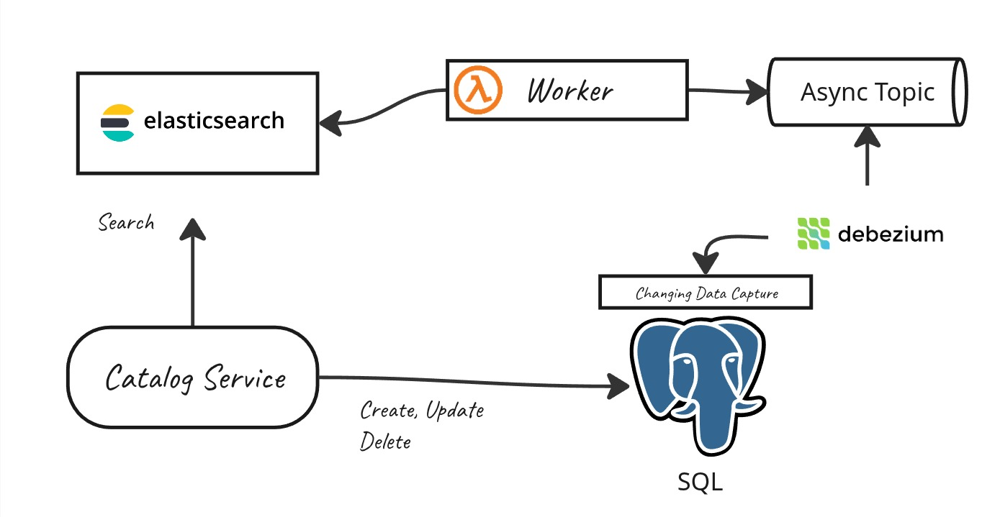

# Ecommerce Catalog

This API allows merchants to submit their product catalog to the marketplace. Since merchants identify products by name rather than by an internal ID, the system is responsible for finding the right match in the platform's existing catalog and linking those products to it. The input is a JSON file containing the merchant's product list, and for each entry the system looks up the corresponding product and registers it in the catalog of that merchant.

## Approach

### Normalized index

The first layer of matching relies on a SQLite function-based index created over the normalized form of `Name`, `Brand`, and `Category`:

```sql
CREATE INDEX idx_product_normalized
  ON Product (normalize(Name), normalize(Brand), normalize(Category));
```

The `normalize` function strips diacritics, removes punctuation, lowercases, and collapses extra whitespace. This makes the index able to match products that are textually the same but written inconsistently across merchants.

This covers cases like:

| Merchant input | Normalizes to |
|---|---|
| `"Smartphone  Galaxy S23"` | `"smartphone galaxy s23"` (extra whitespace collapsed) |
| `"Câmera Canon EOS R6"` | `"camera canon eos r6"` (diacritics removed) |
| `"Tablet iPad Pro 12.9''"` | `"tablet ipad pro 129"` (punctuation stripped) |

The catalog entries normalize to the same values, so the index finds the match.

### Name and brand fallback

When the exact match by name, brand, and category fails, the system tries again using only name and brand. This handles cases where the same product is registered under slightly different category names across merchants.

A real example from the dataset:

| Field | Merchant (GardenStore) | Product |
|---|---|---|
| Name | `"Camera Canon EOS R6"` | `"Camera Canon EOS R6"` |
| Brand | `"Canon"` | `"Canon"` |
| Category | `"Photo"` | `"Photography"` |

The category mismatch causes the first lookup to fail. Falling back to name and brand returns a single result, which is enough to confirm the match.

This means two database calls are made for these cases, which is not ideal. However, always including category in the first lookup is a deliberate choice: it reduces the chance of a false positive by requiring a stricter match before relaxing the criteria.

### Token similarity (Jaccard)

When neither of the previous lookups produces a match, the system fetches all products from that brand and runs a token-based similarity comparison against the incoming name. This handles cases where the product name differs more significantly, such as words in a different language.

The similarity score is computed as the Jaccard index between the two tokenized names:

```
jaccard = |intersection| / |union|
```

A match is accepted only if the score is at or above 0.5 and the names share at least one strong token. A strong token is either a token that contains both letters and digits (like `"7950x"`) or one that is at least 4 characters long (like `"ryzen"`). This prevents short or generic tokens like `"9"` from anchoring a false match.

A real example from the dataset:

| | Merchant (SuperMart) | Catalog |
|---|---|---|
| Name | `"Processador AMD Ryzen 9 7950X"` | `"Processor AMD Ryzen 9 7950X"` |
| Brand | `"AMD"` | `"AMD"` |

After normalization, the token sets are `{processador, amd, ryzen, 9, 7950x}` and `{processor, amd, ryzen, 9, 7950x}`. The intersection is 4 tokens, the union is 6, giving a Jaccard of `0.67`. The shared strong tokens are `ryzen` and `7950x`, so the match is confirmed.

## Production design



In production, the Catalog Service would search for products directly in Elasticsearch, which handles fuzzy and name-based matching natively and at scale. This eliminates the need for the custom normalization and Jaccard logic entirely. The SQL database remains the source of truth, and Debezium keeps Elasticsearch in sync by capturing database changes via CDC and publishing them to an async topic that a worker consumes. The merchant request flow itself stays synchronous: the service queries Elasticsearch, finds the match, and registers the product.

## API

### `POST /catalog/import`

Accepts a multipart form request with a `file` field containing a JSON array of products.

**Request body (JSON file):**

```json
[
  {
    "Id": "a1b2c3d4-e5f6-4a5b-8c9d-0e1f2a3b4c5d",
    "SellerName": "MegaStore",
    "Name": "Smartphone Galaxy S23",
    "Brand": "Samsung",
    "Category": "Electronics"
  }
]
```

**Response:**

```json
{
  "total": 10,
  "linked": 8,
  "notFound": 2,
  "notFoundRequests": ["a1b2c3d4-e5f6-4a5b-8c9d-0e1f2a3b4c5d", "b2c3d4e5-f6a7-4b5c-9d0e-1f2a3b4c5d6e"]
}
```

The response is designed to give the caller a clear picture of what happened with each product in the submission. `linked` tells how many products were successfully matched and registered in the merchant's catalog. `notFoundRequests` lists the IDs of every product that could not be matched, so the merchant knows exactly what needs attention without having to guess.

| Field | Description |
|---|---|
| `total` | Total number of products in the submitted file |
| `linked` | Number of products successfully matched and registered |
| `notFound` | Number of products that had no match in the catalog |
| `notFoundRequests` | List of merchant product IDs that could not be matched |

## How to run

**With Docker:**

```bash
docker compose up
```

The API will be available at `http://localhost:3000`.

**Without Docker:**

```bash
npm install
npm run dev
```

**Importing a product list:**

```bash
curl -X POST http://localhost:3000/catalog/import \
  -F "file=@ProductEntry.json"
```

## How to test

```bash
npm test
```

To run in watch mode:

```bash
npm run test:watch
```